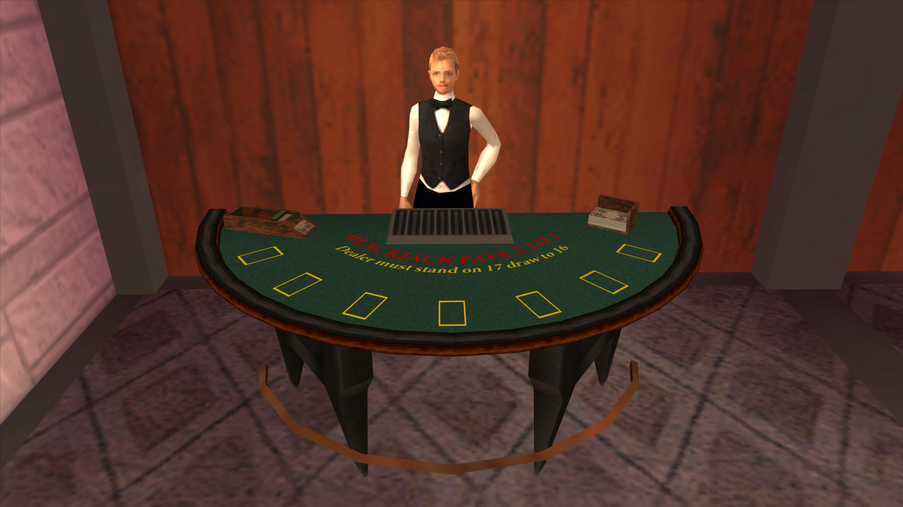
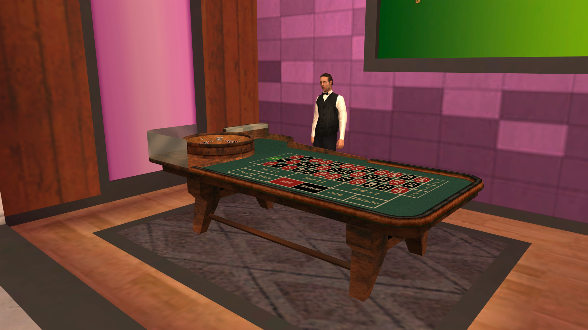
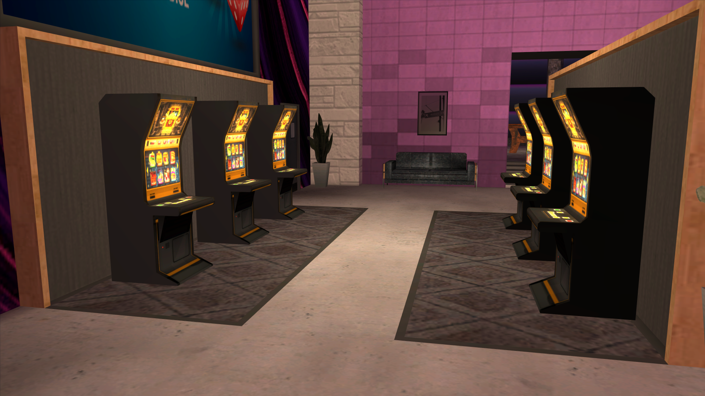
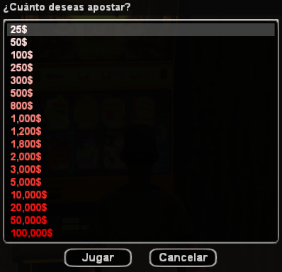
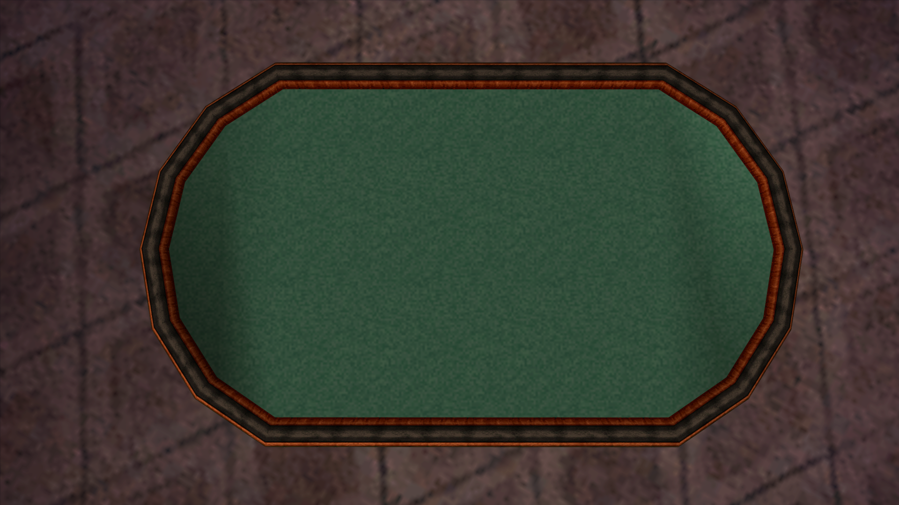

# Sistema de casino

## Introducción

El **Emerald Isle Casino** es el epicentro del entretenimiento y el lujo en San Andreas, ubicado en Las Venturas. Combina un **bar**, un **restaurante**, una **terraza** y amplias **áreas de juego** en un mismo espacio, pensado para el roleplay social y las grandes apuestas.

Dentro del casino se pueden jugar **tragamonedas**, **ruleta** y **blackjack**. El **póker Texas Hold'em**, en cambio, ya no está atado al casino: cualquier jugador puede comprar una mesa como mueble y colocarla en **cualquier tipo de propiedad** (clubes, bares, casas, negocios, etc.), ampliando enormemente las opciones de roleplay alrededor del juego.

El casino además ofrece dinámicas propias como la **compra de acciones** y el cobro de **ingresos mensuales** derivados de los beneficios del local, convirtiéndolo en un atractivo negocio a largo plazo.

## Requisitos para jugar

- Para entrar al casino y usar los minijuegos de casa (tragamonedas, ruleta y blackjack) es necesario tener activada la **autenticación en dos pasos (2FA)** en la cuenta.
- Sin 2FA, el servidor bloquea el acceso a los minijuegos del casino con el mensaje:
  *"Para jugar en el casino debes activar la doble autenticación (2FA) en tu cuenta."*
- No se puede jugar mientras se esté usando el teléfono ni participando en otro minijuego de azar al mismo tiempo.

## Comando principal

- `/casino` — muestra la ayuda del casino.
- `/casino slot` — abre una máquina tragamonedas disponible.
- `/casino ruleta` — te sienta en una mesa de ruleta.
- `/casino blackjack` — te sienta en una mesa de blackjack.
- `/casino stats` — muestra tu **balance histórico** (ganancias menos pérdidas) en tragamonedas, ruleta, blackjack y póker, con el color en verde si vas en positivo o en rojo si vas en negativo.
- `/poker` o `/pkr` — atajo para la ayuda del sistema de póker (ver sección de póker).

---

## 1. Blackjack

El **blackjack** es un juego de cartas cuyo objetivo es sumar **21 puntos** o acercarse lo más posible sin pasarse, enfrentándote al crupier.

### Valor de las cartas

- Las cartas del **2 al 10** mantienen su valor numérico.
- **Jota (J), Reina (Q) y Rey (K)** valen 10 puntos cada una.
- El **As** vale 1 o 11 puntos, según lo que más beneficie a la mano.

### Desarrollo de la mano

Al inicio se reparten **dos cartas** a cada jugador y dos al crupier (una boca abajo). En tu turno puedes:

- **Pedir** otra carta para acercarte a 21.
- **Plantarte** y conservar tu mano actual.
- Si te **pasas de 21**, pierdes automáticamente la apuesta ("pasarse" o *bust*).

Cuando terminan todos los jugadores, el crupier revela su carta oculta y **pide cartas hasta alcanzar al menos 17 puntos**, momento en el que se planta obligatoriamente.

### Resultados y pagos

- **Ganas** si tu mano supera la del crupier sin pasarte, o si el crupier se pasa de 21.
  - **Pago**: x1.5 sobre la apuesta.
- **Blackjack natural** (As + carta de valor 10 en las dos primeras cartas): se paga con un **multiplicador especial más alto** que una victoria normal.
  - **Pago**: x2 sobre la apuesta.
- **Six Card Charlie**: si llegas a 21 o menos usando **seis cartas** sin pasarte, recibes un **pago aumentado** aunque el crupier no se pase.
- **Empate (push)**: se te devuelve la apuesta sin ganancia ni pérdida.
- **Derrota**: pierdes la apuesta inicial.

### Apuestas

- Apuesta mínima: **$1.000**.
- Apuesta máxima: **$1.000.000**.
- El Emerald Isle dispone de **3 mesas de blackjack**.

---

## 2. Ruleta

La **ruleta europea** es un juego de azar en el que apuestas al número o color en el que caerá la bola sobre una rueda giratoria. La rueda tiene **37 casillas** (del 0 al 36), que alternan entre **rojo y negro**, salvo el 0.

Puedes apostar a un número concreto, a rangos, a paridad o a color. Los pagos de la mesa son:

| Apuesta | Números | Pago |
|---|---|---|
| Número en específico | Uno solo (0 a 36) | **36:1** |
| Primer tercio (columna) | 1, 4, 7, 10, 13, 16, 19, 22, 25, 28, 31, 34 | **3:1** |
| Primer grupo de 12 | 1 al 12 | **3:1** |
| Segundo grupo de 12 | 13 al 24 | **3:1** |
| Tercer grupo de 12 | 25 al 36 | **3:1** |
| Segundo tercio (columna) | 2, 5, 8, 11, 14, 17, 20, 23, 26, 29, 32, 35 | **2:1** |
| Tercer tercio (columna) | 3, 6, 9, 12, 15, 18, 21, 24, 27, 30, 33, 36 | **2:1** |
| 1 a 18 | 1 al 18 | **1:1** |
| 19 a 36 | 19 al 36 | **1:1** |
| Par | Números pares | **1:1** |
| Impar | Números impares | **1:1** |
| Rojo | Números rojos | **1:1** |
| Negro | Números negros | **1:1** |

> Si la bola cae en el **0**, ganan únicamente las apuestas directas al 0. Todas las apuestas a color, paridad, grupos y tercios pierden.

El Emerald Isle cuenta con **2 mesas de ruleta** activas. Cada mesa tiene configurada una **apuesta máxima**; si intentas apostar por encima, el sistema te lo impedirá.

---

## 3. Máquinas tragamonedas

Las **tragamonedas** ("slots") son máquinas de azar en las que eliges una apuesta, giras los tres rodillos y cobras según la combinación final de símbolos.

### Combinaciones y multiplicadores

| Combinación | Símbolo | Multiplicador |
|---|---|---|
| Doble barra de oro | 🟨🟨 | **x25** |
| Barra de oro simple | 🟨 | **x10** |
| Campanas | 🔔 | **x5** |
| Cerezas | 🍒 | **x3** |
| Uvas | 🍇 | **x1.75** |
| Número 69 | 6️⃣9️⃣ | **x0.5** |

El pago se calcula multiplicando la apuesta por el multiplicador de la combinación obtenida.

### Apuestas disponibles

Las tragamonedas permiten elegir entre distintos tramos fijos de apuesta, desde **$25** hasta **$100.000** por giro, lo que permite jugadas accesibles y también apuestas para grandes roleplays.

### Sala de tragamonedas

- El Emerald Isle dispone de **30 máquinas tragamonedas** distribuidas en su sala principal.
- Dispone también de una opción de **giro automático** para repetir la apuesta cómodamente.

---

## 4. Póker Texas Hold'em ♦️

El **póker Texas Hold'em** es una variante en la que a cada jugador se le reparten **dos cartas privadas** y se colocan hasta **cinco cartas comunitarias** sobre la mesa en tres fases: **flop** (3 cartas), **turn** (1 carta) y **river** (1 carta). En cada ronda de apuestas los jugadores pueden **igualar**, **subir**, **pasar**, **retirarse** o ir **all-in**.

El objetivo es formar la **mejor jugada de cinco cartas** combinando tus dos cartas privadas y las cinco comunitarias.

### Novedad — Disponible en cualquier propiedad

A diferencia de los otros juegos del casino, el póker ya **no se limita al Emerald Isle**:

- Cualquier jugador puede **comprar una mesa de póker** como mueble mediante el menú de muebles de la propiedad o con `/comprarmueble 19474`.
- La mesa se puede colocar en **cualquier tipo de propiedad** (clubes, bares, casinos privados, casas, negocios, etc.).
- Se pueden ejecutar **varias partidas simultáneas**, con hasta **seis jugadores por mesa**.

Esto habilita roleplay de salas privadas, torneos caseros, clubes sociales y más.

### Baraja y jugadores

- Se juega con una **baraja inglesa de 52 cartas**.
- De **2 a 6 jugadores** por mesa.
- Orden de cartas de mayor a menor: **A, K, Q, J, 10, 9, 8, 7, 6, 5, 4, 3, 2**.
- Los palos **no tienen jerarquía** entre sí.

### Flujo básico de partida

1. Los jugadores se unen a la mesa con `/pkr unirse` o `/pkr sentarse`.
2. Cada jugador cambia su estado a **"listo"** desde la interfaz.
3. Cuando todos están listos, cualquiera puede iniciar con `/pkr comenzar`.
4. Durante las manos, se apuesta desde los botones centrales (subir, pasar, igualar, retirarse, all-in…).
5. Al terminar la partida se reparten las fichas; con `/pkr siguiente` se reinicia la mesa para una nueva ronda.

### Comandos básicos

- 🆘 `/pkr ayuda` — lista todos los comandos disponibles.
- 🎮 `/pkr unirse` — te sientas en una mesa.
- 🎮 `/pkr sentarse` / `/pkr levantarse` — tomar o soltar un asiento.
- 🎮 `/pkr abandonar` — abandonas la mesa.
- 🎮 `/pkr comenzar` — inicias la partida cuando todos están listos.
- 🎮 `/pkr siguiente` — reinicias la mesa si la partida terminó.
- 🎮 `/pkr fichas` — añadir fichas (dinero) a tu pila en la mesa.
- 🎞️ `/pkr spec` — observar una partida en curso.
- 🎞️ `/pkr cam` — alternar la vista de cámara.
- 🖱️ `/pkr mouse` — recupera el cursor si se pierde.

### Comandos para dueños de negocio

Los propietarios de la propiedad en la que esté colocada la mesa pueden ajustar parámetros específicos:

- 💼 `/pkr apuesta` — cambia la **apuesta mínima (ciega)** antes de comenzar la ronda.
- 💼 `/pkr comision` — establece la **comisión por juego** que va directamente a la caja de la propiedad en cada pago.
- 💼 `/pkr temporizador` — establece el **tiempo máximo por turno** de cada jugador (por defecto, 20 segundos).

### Recursos para aprender

- [Tutorial de PokerStars](https://www.pokerstars.es/poker/games/texas-holdem/)
- [Tutorial de EducaPoker](https://www.educapoker.com/)
- [Entrada de Wikipedia sobre Texas Hold'em](https://es.wikipedia.org/wiki/Texas_hold_%27em)

---

## 5. Acciones y negocio del casino

El Emerald Isle Casino no solo es un lugar para jugar: también funciona como una **propiedad con beneficios compartidos**.

- Los jugadores pueden **adquirir acciones (shares)** del casino.
- Los beneficios generados por los minijuegos (tragamonedas, ruleta y blackjack) se acumulan en la **caja del casino**.
- Cada mes, los accionistas reciben **ingresos proporcionales** a su participación sobre los beneficios acumulados.

Esto convierte al casino en una inversión de largo plazo que premia a los jugadores que apuestan por el proyecto a nivel roleplay y económico.

---

## 6. Estadísticas personales

Con `/casino stats` se pueden consultar, en cualquier momento, tus **balances netos de por vida** en cada juego:

- Tragamonedas.
- Ruleta.
- Blackjack.
- Póker.

El balance se muestra en **verde** si has ganado más de lo que has apostado en ese juego, y en **rojo** si has perdido más de lo que has ganado. Es una forma rápida de llevar el control sobre tu historial como jugador.

---

> **Recordatorio:** el casino está pensado como **entretenimiento roleplay**. Apuesta con cabeza, define un presupuesto antes de empezar y recuerda que cada juego tiene su propio ritmo, sus propios límites de apuesta y sus propios pagos.
